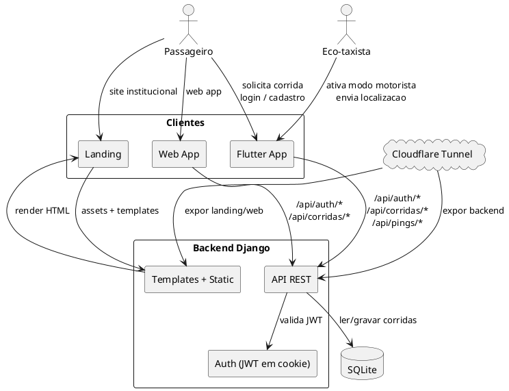
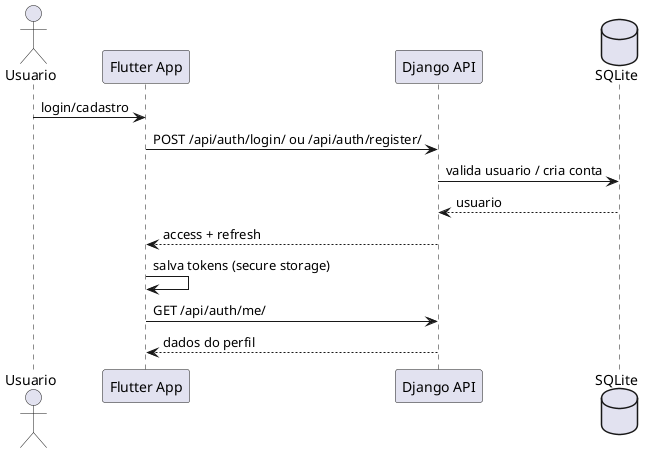
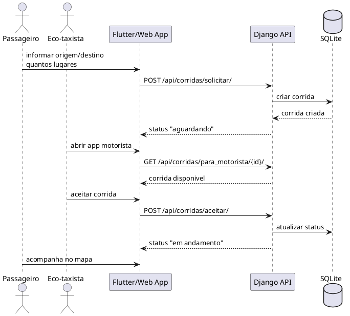
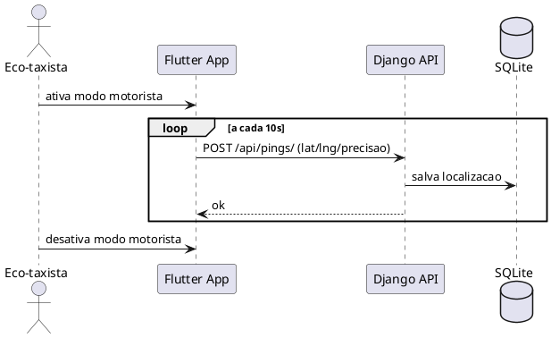

# Vai Paqueta - Plataforma de eco-taxi (Django + Flutter)

Este repositorio contem:
- Backend em Django (API + landing + web app).
- App mobile em Flutter (Android).
- Infra local de apoio (Nginx, Docker e Cloudflared).

## Visao geral
O Vai Paqueta conecta passageiros e eco-taxistas na Ilha de Paqueta. O app organiza pedidos, permite acompanhar a corrida no mapa e repassa a chamada para o motorista mais proximo.

Regras de produto atuais:
- O app nao cobra taxa e nao processa pagamento.
- O pagamento e combinado diretamente entre passageiro e eco-taxista.
- Limite atual: 2 lugares por corrida.
- Uso permitido apenas para maiores de 18 anos.
- Para eco-taxista, a localizacao pode ser enviada em segundo plano quando o modo motorista esta ativo.

## Estrutura do repositorio
- `vai_paqueta_backend/`: backend Django (API REST + templates da landing e web app).
- `vai_paqueta_app/`: app Flutter (Android).
- `nginx/`: configuracao de proxy para Docker.
- `docker-compose.yml`: sobe backend + nginx localmente.
- `run.bat`: inicia Django + Cloudflared no Windows.

## Stack
- Backend: Django 5, DRF, SimpleJWT, SQLite.
- Front web (landing e web app): templates Django + JS + Leaflet.
- Mobile: Flutter (Android).
- Infra: Nginx, Docker, Cloudflare Tunnel.

## Diagramas (PlantUML)

### Arquitetura geral (Flutter + Web + Django)


### Fluxo de autenticacao (Flutter)


### Fluxo de corrida (passageiro -> motorista)


### Envio de localizacao (modo motorista)


### Renderizar os diagramas
- Use a extensao PlantUML no VS Code ou o site https://www.plantuml.com/plantuml
- Copie o bloco `plantuml` e gere a imagem.

## Backend (Django)

### Requisitos
- Python 3.12+
- pip

### Instalar e rodar localmente
1) Crie e ative o venv:
```
python -m venv .venv
.\.venv\Scripts\activate
```

2) Instale dependencias:
```
pip install -r vai_paqueta_backend/requirements.txt
```

3) Rode migrations:
```
cd vai_paqueta_backend
python manage.py migrate
```

4) Suba o servidor:
```
python manage.py runserver 127.0.0.1:8000
```

### Variaveis de ambiente
Arquivo: `vai_paqueta_backend/.env`

Principais variaveis:
- `DJANGO_SECRET_KEY`
- `DJANGO_DEBUG` (1/0)
- `DJANGO_ALLOWED_HOSTS` (ex: `localhost,127.0.0.1,vaipaqueta.com.br`)
- `DJANGO_CSRF_TRUSTED_ORIGINS`
- `DJANGO_DB_PATH` (default: sqlite em `db.sqlite3`)
- `DJANGO_CORS_ALLOW_ALL` (1/0)
- `DJANGO_CORS_ALLOWED_ORIGINS`
- `DJANGO_JWT_COOKIE_SECURE` (1/0)
- `DJANGO_JWT_COOKIE_SAMESITE`
- `DJANGO_JWT_COOKIE_DOMAIN`
- `DJANGO_JWT_COOKIE_PATH`
- `DJANGO_CORS_ALLOW_CREDENTIALS`

### Endpoints principais
- `GET /` landing
- `GET /app/` web app
- `GET /privacidade/` politica de privacidade
- `GET /api/geo/countries/` lista de DDIs (usa `phonenumbers` + `pycountry`)

### Dados estaticos
- Tiles locais: `vai_paqueta_backend/static/landing/assets/tiles/`
- Enderecos: `vai_paqueta_backend/static/landing/data/addresses.json`
- Hero image: `vai_paqueta_backend/static/landing/assets/images/hero/phone.png`

## Web app (Django + JS)
O web app usa as mesmas rotas do backend e mantem sessao via JWT em cookies.

Config principal:
- Template: `vai_paqueta_backend/templates/webapp/index.html`
- JS interno carrega lista de DDI em `/api/geo/countries/`

Se a lista nao carregar, o fallback mostra apenas Brasil (+55).

## Flutter (Android)

### Requisitos
- Flutter (stable)
- Android SDK

### Rodar em debug
```
cd vai_paqueta_app
flutter pub get
flutter run
```

### App release (AAB)
1) Crie o keystore (uma vez):
```
keytool -genkeypair -v -keystore %USERPROFILE%\\vai-paqueta-upload.keystore -storetype JKS -keyalg RSA -keysize 2048 -validity 10000 -alias upload
```

2) Crie `vai_paqueta_app/android/key.properties`:
```
storePassword=SUASENHA
keyPassword=SUASENHA
keyAlias=upload
storeFile=C:\\Users\\Angelo\\vai-paqueta-upload.keystore
```

3) Build do AAB:
```
flutter clean
flutter pub get
flutter build appbundle --release
```

Arquivo final:
```
vai_paqueta_app/build/app/outputs/bundle/release/app-release.aab
```

### Package name
Aplicativo configurado com:
```
br.com.vaipaqueta.app
```

## Docker (opcional)
Para subir backend + nginx:
```
docker compose up --build
```

## Cloudflared (opcional)
Para expor o backend via tunnel:
```
cloudflared tunnel run vai-paqueta-backend
```

## Politica de privacidade
URL publicada:
```
https://vaipaqueta.com.br/privacidade/
```

## Observacoes importantes
- Atualizacoes na Play Store exigem o mesmo keystore.
- Se usar localizacao em segundo plano, a Play Console exige declaracao e video.
- Para producao, a Play exige teste fechado com 12 testadores por 14 dias.

## Contato
Responsavel: Angelo Gama
Email: angelobeta@gmail.com
